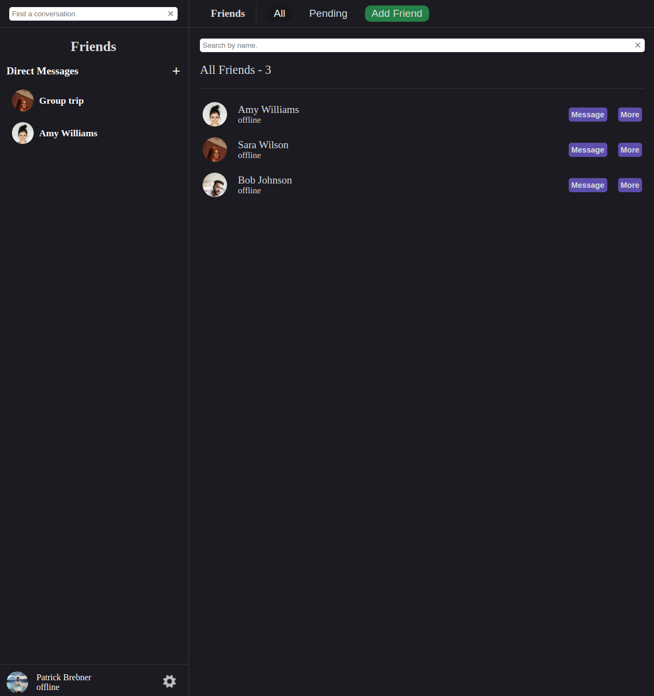
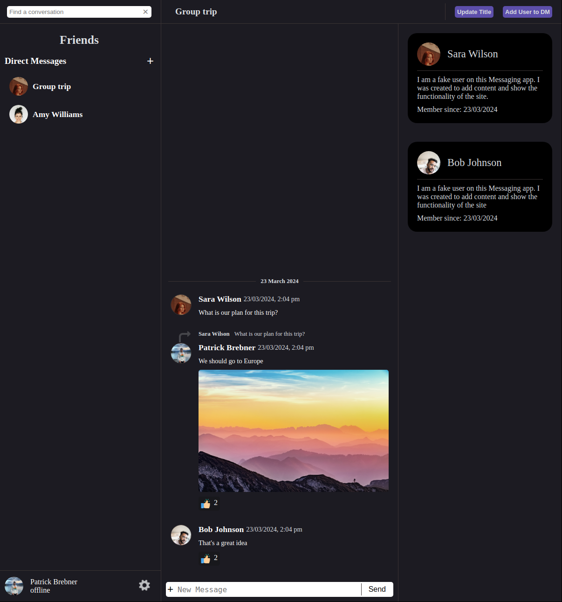
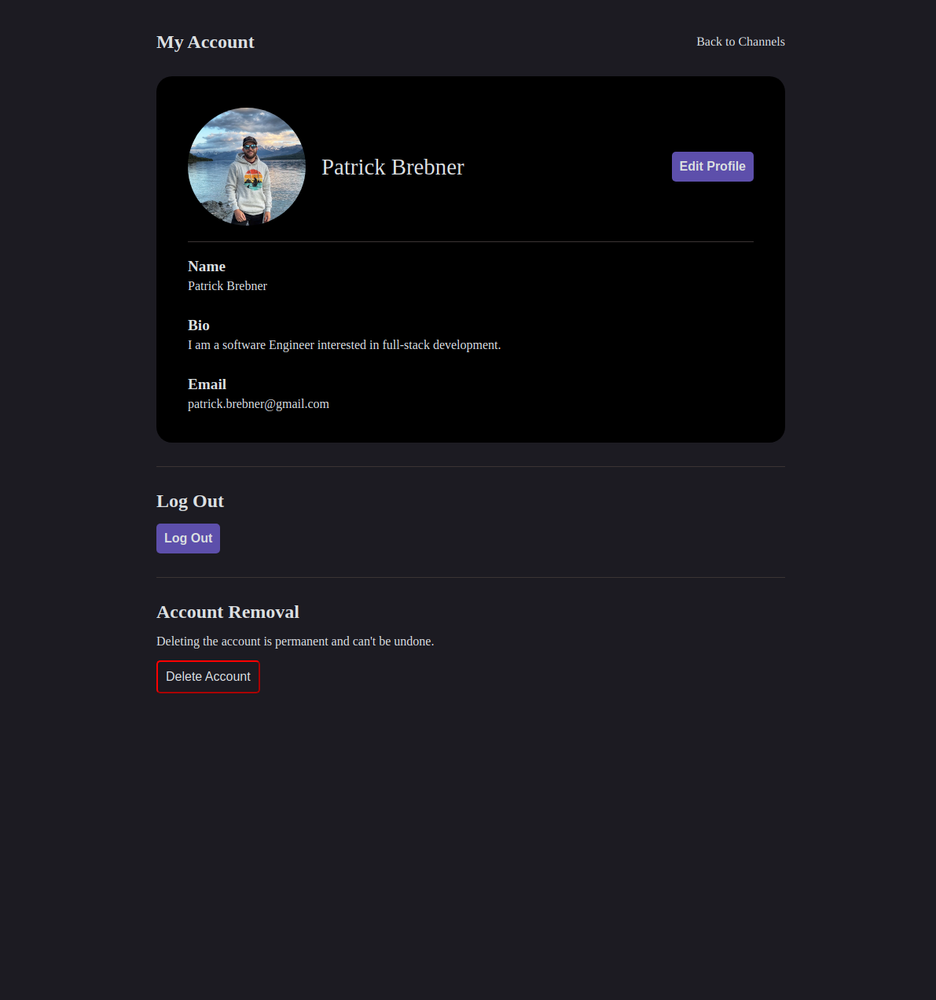

# Message Client [In Developement]

## About

This project was made as part of The ODIN Project's NodeJS curriculum. This repository comprises the frontend portion of this app.

[Link to API](https://github.com/pbrebner/message-api)

## Features

-   Persistent Authentication using JWTs
-   Intuitive User Interface
-   Integration with Backend/API

## Technologies Used

-   React
-   React Router
-   HTML/CSS
-   JWTs
-   AWS S3
